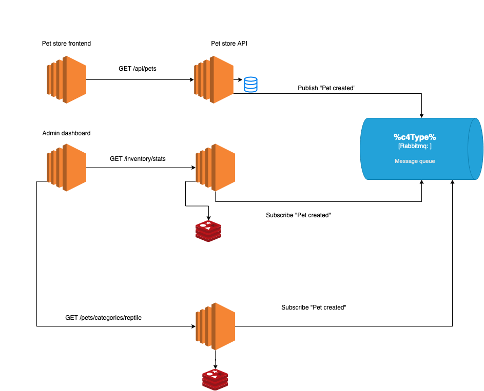

# Pets Store Microservice

The No name pet store is a pet store management application 


## Architecture
Pet store is composed of 4 services, two of which communicate over rabbitmq  and the rest over HTTP 




| Service    | Language/framework | description                                        |
|------------|--------------------|----------------------------------------------------|
| Pet-store  | python/django      | renders available pets from the api                |
| Pet-api    | python/flask       | handles storage of pets                            |
| Inverntory | python/flask       | handles inventroy management when pets are created |

## Setup 

Running this application is as easy as `docker-compose up` 

Note! The category service might fail if rabbitmq hasn't started up , so make sure to run `docker-compose up category` when rabbitmq has fully started

Next create a few pets in the api by running the following curl commands 

```bash
curl  -d '{"name":"mr snow","notes":"feed twice daily"}' -H "Content-Type: application/json" localhost:6000/api/pets 
```
### Sample response
```json
{
  "id": 4,
  "name": "mr snow",
  "notes": "feed twice daily"
}
```

Now you can access the pet store UI at http://localhost:5000/ 


to Access the inventory api simply curl 
`curl localhost:7000/inventory/stats`
## Sample response
```json
{
  "total_pets": 3
}
```

Navigate to http://localhost:4000/ to access the admin dashboard


 